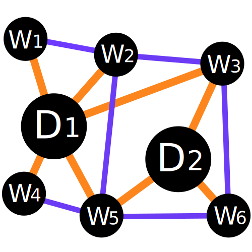
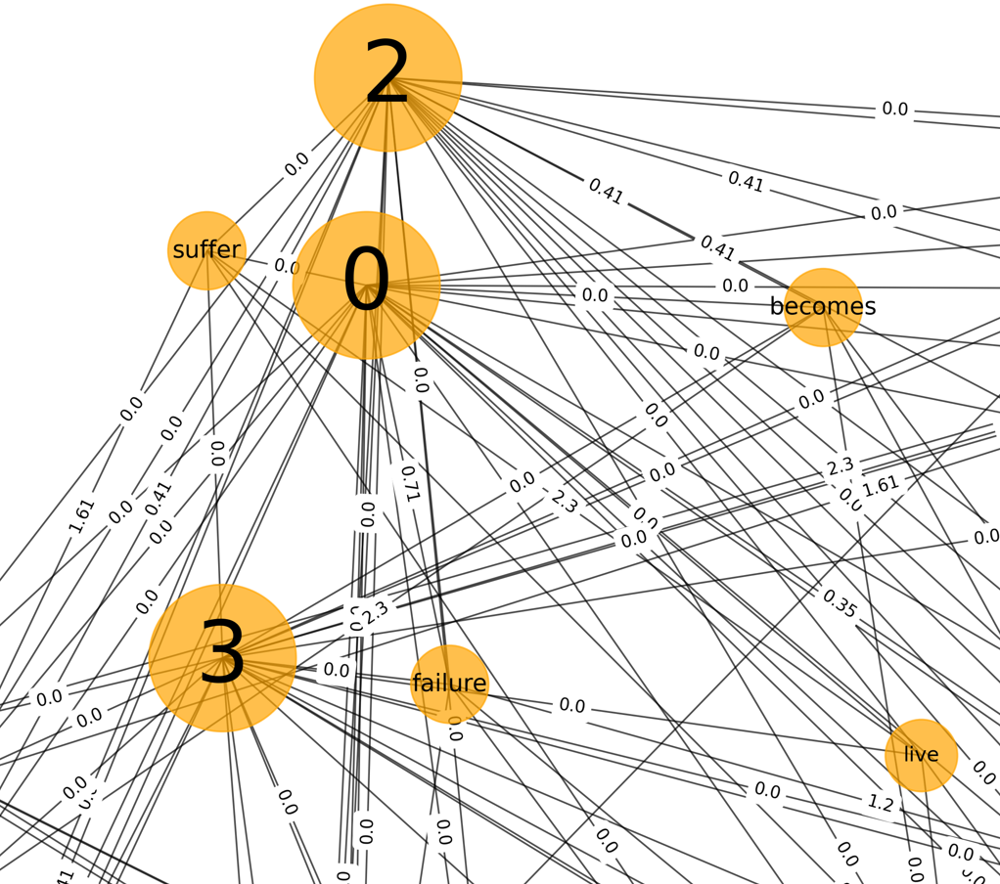

<div align="center">
  
  <h1 style="margin-bottom:40px; margin-top:20px">Text for GCN</h1>
</div>

-----------------

[](https://opensource.org/licenses/MIT)
[](https://text4gcn.readthedocs.io/en/latest/?badge=latest)


[](https://www.python.org/)
[](https://nsdpy.readthedocs.io/en/latest/?badge=latest)
[](https://colab.research.google.com/github/vitormeriat/text4gcn/blob/master/notebooks/text4gcn.ipynb)

<div id="top"></div>

GCN applied in a text classification context.

### **Table of Contents**

<ol>
    <li><a href="#abstract">Abstract</a></li>
    <li><a href="#installation">Installation</a></li>
    <li><a href="#functionalities">Functionalities</a></li>    
    <li><a href="#examples">Examples</a></li>
    <ul>
        <li><a href="#installation">Get Sample Data</a></li>
        <li><a href="#datasets-description">Text Pipeline</a></li>
        <li><a href="#datasets-description">Builder Adjacency</a></li>
    </ul>
    <li><a href="#contributing">Contributing</a></li>
    <li><a href="#license">License</a></li>
    <li><a href="#references">References</a></li>
</ol>

<div style="margin-bottom:60px"></div>

## Abstract

This project aims to exam the text classification problem with novel approaches Graph Convolutional Networks and Graph Attention Networks using Deep Learning algorithms and Natural Language Processing Techniques.


<div style="margin-bottom:30px; margin-top:30px" align="center">
  
  <p style="margin-top:5px">Text graph</p>
</div>

<p style="margin-bottom:20px; margin-top:40px" align="right">(<a href="#top">back to top</a>)</p>

---

## Installation

Text4GCN is available at `PyPI`:

```python
pip install text4gcn
```

<p style="margin-bottom:20px; margin-top:40px" align="right">(<a href="#top">back to top</a>)</p>

---

## Functionalities

* **Datasets**: ... 
* **Preprocess**: ... 
* **Build Adjacency**: ... 
* **Models**: ... 

<p style="margin-bottom:20px; margin-top:40px" align="right">(<a href="#top">back to top</a>)</p>

---

## Examples

... 

### Get data 

```python
from text4gcn.datasets import data

# List of all available datasets
data.list()

# Download sample data for a specific folder
data.R8('my_folder').load()
data.R52('my_folder').load()
data.AG_NEWS('my_folder').load()
```

**Available Datasets:**

+ R8 (Reuters News Dataset with 8 labels)
+ R52 (Reuters News Dataset with 52 labels)
+ 20ng (Newsgroup Dataset)
+ Ohsumed (Cardiovascular Diseases Abstracts Dataset)
+ MR (Movie Reviews Dataset)
+ Cora (Citation Dataset)
+ Citeseer (Citation Dataset)
+ Pubmed (Citation Dataset)

**Datasets Description:**

| Dataset | Docs | Training | Test | Words | Nodes | Classes | Average Length |
| --- | --- | --- | --- | --- | --- | --- | --- |
| 20NG    | 18,846 | 11,314 | 7,532 | 42,757 | 61,603 | 20 | 221.26 |
| R8      | 7,674  | 5,485  | 2,189 | 7,688  | 15,362 | 8  | 65.72  |
| R52     | 9,100  | 6,532  | 2,568 | 8,892  | 17,992 | 52 | 69.82  |
| MR      | 10,662 | 7,108  | 3,554 | 18,764 | 29,426 | 2  | 20.39  |
| Ohsumed | 7,400  | 3,357  | 4,043 | 14,157 | 21,557 | 23 | 135.82 |

---

### Text Pipeline 

```python
from text4gcn.preprocess import TextPipeline

# Load the query, (optional) weight vector and sequence
pipe = TextPipeline(
    dataset_name="R8",
    rare_count=5,
    dataset_path="my_folder",
    language="english"
)

# Selects the Dynamic Time Warping (DTW) as the distance for the segmentation
pipe.execute()
```

### Frequency Adjacency 

```python
from text4gcn.builder import FrequencyAdjacency

# Load the query, (optional) weight vector and sequence
freq = FrequencyAdjacency(
    dataset_name="R8",
    dataset_path="my_folder"
)

# Selects the Dynamic Time Warping (DTW) as the distance for the segmentation
freq.build()

```

<p style="margin-bottom:20px; margin-top:40px" align="right">(<a href="#top">back to top</a>)</p>

---


## Contributing

Contributions are **greatly appreciated**. If you want to help us improve this software, please fork the repo and create a new pull request. Don't forget to give the project a star! Thanks!

1. Fork the Project
2. Create your Feature Branch (`git checkout -b feature/AmazingFeature`)
3. Commit your Changes (`git commit -m 'Add some AmazingFeature'`)
4. Push to the Branch (`git push origin feature/AmazingFeature`)
5. Open a Pull Request

Alternatively, you can make suggestions or report bugs by opening a new issue with the appropriate tag ("feature" or "bug") and following our Contributing template.

<p style="margin-bottom:20px; margin-top:40px" align="right">(<a href="#top">back to top</a>)</p>

---

## License

Distributed under the MIT License. See `LICENSE.txt` for more information.

<p style="margin-bottom:20px; margin-top:40px" align="right">(<a href="#top">back to top</a>)</p>

---

## References

+ [Kipf and Welling, 2017]  Semi-supervised Classification with Graph Convolutional Networks
+ [Liang Yao, Chengsheng Mao, Yuan Luo, 2018] Graph Convolutional Networks for Text Classification


<p style="margin-bottom:20px; margin-top:40px" align="right">(<a href="#top">back to top</a>)</p>