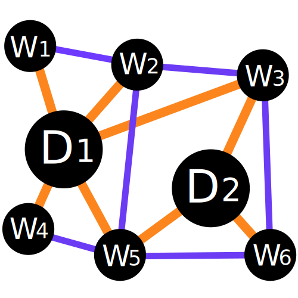

  

<!-- TABLE OF CONTENTS -->

  
Table of Contents

  <ol>
    <li>
      <a href="#about-the-project">About The Project</a>
    </li>
    <li>
      <a href="#clean-code">Clean Code</a>
      <ul>
        <li><a href="#none">Naming Things</a></li>
        <li><a href="#none">Functions</a></li>
        <li><a href="#none">Objects and Data Structures</a></li>
        <li><a href="#none">Classes</a></li>
        <li><a href="#none">SOLID Principles</a></li>
        <li><a href="#none">Testing</a></li>
      </ul>
    </li>
    <li>
      <a href="#none">Code Quality Measurement</a>
      <ul>
        <li><a href="#none">1. Code complexity</a></li>
        <li><a href="#none">2. Code coverage</a></li>
        <li><a href="#none">3. Bug density</a></li>
        <li><a href="#none">4. Duplicated code</a></li>
        <li><a href="#none">5. Code maintainability</a></li>
        <li><a href="#none">6. Coding standards</a></li>
        <li><a href="#none">7. Security vulnerabilities</a></li>
      </ul>
    </li>
    <li><a href="#contributing">Contributing</a></li>
    <li><a href="#license">License</a></li>
    <li><a href="#contact">Contact</a></li>
    <li><a href="#acknowledgments">Acknowledgments</a></li>
  </ol>

## Why Text4GCN?

**Graph4NLP** is an easy-to-use library for R&D at the intersection of **Deep Learning on Graphs** and **Natural Language Processing** (i.e., DLG4NLP). It provides both **full implementations** of state-of-the-art models for data scientists and also **flexible interfaces** to build customized models for researchers and developers with whole-pipeline support. Built upon highly-optimized runtime libraries including [DGL](https://github.com/dmlc/dgl) , **Graph4NLP** has both high running efficiency and great extensibility. The architecture of **Graph4NLP** is shown in the following figure, where boxes with dashed lines represents the features under development.

This library has the following key features:

1. **Easy-to-use and Flexible:** Provides both full implementations of state-of-the-art models and alsoflexible interfaces to build customized models with whole-pipeline support.
2. **Rich Set of Learning Resources:** Provide a variety of learning materials including code demos, code documentations, research tutorials and videos, and paper survey.
3. **High Running Efficiency and Extensibility:** Build upon highly-optimized runtime libraries including DGL and provide highly modularization blocks.
4. **Comprehensive Code Examples:** Provide a comprehensive collection of NLP applications and the corresponding code examples for quick-start.

Graph4NLP consists of four different layers: 1) Data Layer, 2) Module Layer, 3) Model Layer, and 4) Application Layer, as illustrated in the following figure.
